# LifeFlow System Diagrams

## Entity Relationship Diagram (ERD)

### Master Database ERD

### Tenant Database ERD

## Class Diagram

```mermaid
classDiagram
    class BaseEntity {
        <<abstract>>
        +string id
        +Date createdAt
        +Date updatedAt
    }
    
    class BaseDAO~T, K~ {
        <<abstract>>
        #PrismaClient prisma
        +findById(id: K) Promise~T~
        +create(data: any) Promise~T~
        +update(id: K, data: any) Promise~T~
        +delete(id: K) Promise~boolean~
    }
    
    class Hospital {
        +string name
        +string address
        +string phone
        +string email
        +string licenseNo
        +string contactPerson
        +boolean isActive
    }
    
    class Donor {
        +string donorId
        +string firstName
        +string lastName
        +string email
        +string bloodGroup
        +Json biometricData
        +boolean isEligible
    }
    
    class BloodUnit {
        +string unitId
        +string donorId
        +string bloodGroup
        +string component
        +Date expiryDate
        +string status
        +Json testResults
    }
    
    class Distribution {
        +string distributionId
        +string bloodUnitId
        +float quantity
        +string purpose
        +string urgency
        +string status
        +string requestingHospitalId
        +string targetHospitalId
    }
    
    class DonorDAO {
        +findByBloodGroup(bloodGroup: string) Promise~Donor[]~
        +checkEligibility(donorId: string) Promise~boolean~
    }
    
    class DistributionDAO {
        +findByStatus(status: string) Promise~Distribution[]~
        +issueDistribution(id: string, approvedBy: string) Promise~Distribution~
        +getStats() Promise~DistributionStats~
    }
    
    class DonorController {
        -DonorDAO dao
        +registerDonor(req: Request, res: Response) Promise~void~
        +checkEligibility(req: Request, res: Response) Promise~void~
    }
    
    class DistributionController {
        -DistributionDAO dao
        +createDistributionRequest(req: Request, res: Response) Promise~void~
        +issueBloodUnits(req: Request, res: Response) Promise~void~
        +getMyRequests(req: Request, res: Response) Promise~void~
    }
    
    class SchemaManager {
        <<singleton>>
        -Map tenantConnections
        +getInstance() SchemaManager
        +getTenantClient(hospitalId: string) PrismaClient
        +getMasterClient() MasterPrismaClient
    }
    
    BaseEntity <|-- Hospital
    BaseEntity <|-- Donor
    BaseEntity <|-- BloodUnit
    BaseEntity <|-- Distribution
    
    BaseDAO <|-- DonorDAO
    BaseDAO <|-- DistributionDAO
    
    DonorController --> DonorDAO : uses
    DistributionController --> DistributionDAO : uses
    
    SchemaManager --> PrismaClient : creates
```

## Sequence Diagrams

### Blood Collection Process

### Cross-Hospital Blood Request

## How to View These Diagrams

1. **GitHub/GitLab**: Renders automatically in markdown files
2. **VS Code**: Install "Mermaid Preview" extension  
3. **Online**: Copy code to https://mermaid.live/
4. **Export**: Use Mermaid CLI or online tools for PNG/SVG