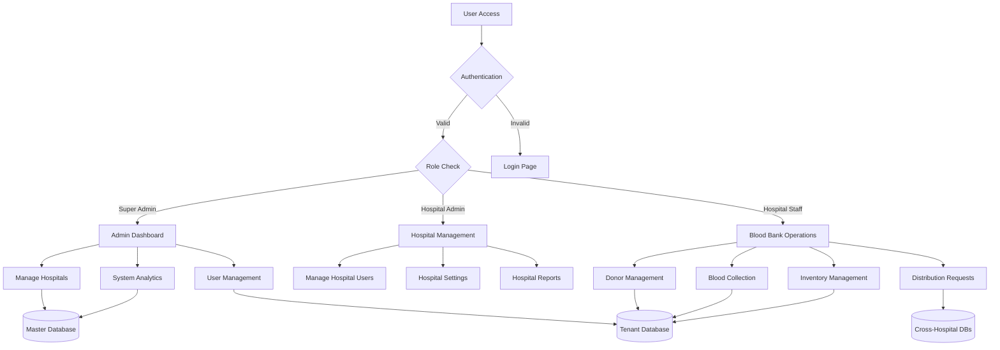
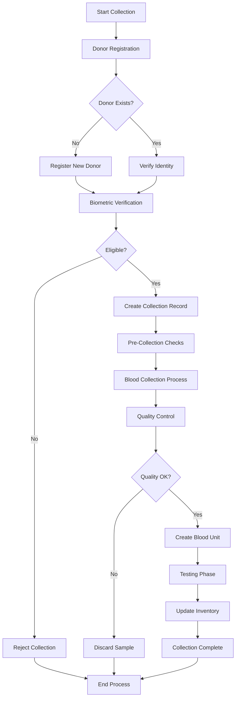
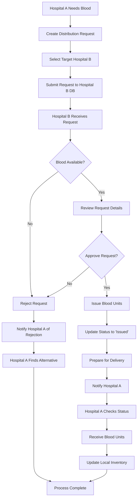
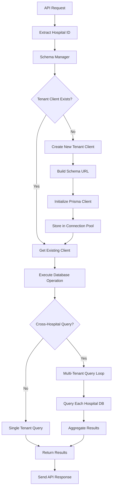
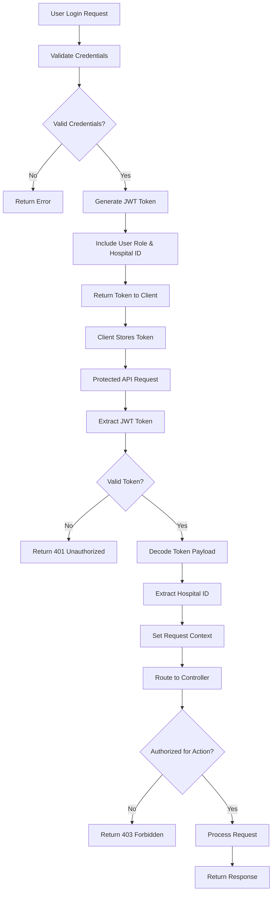
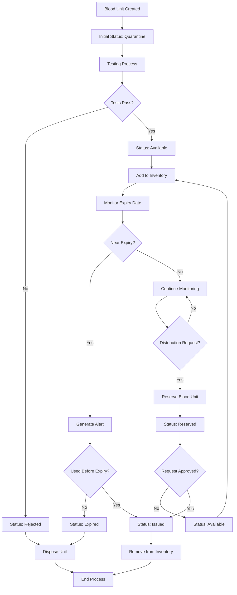
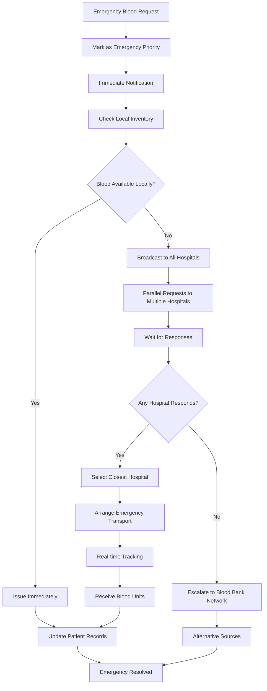
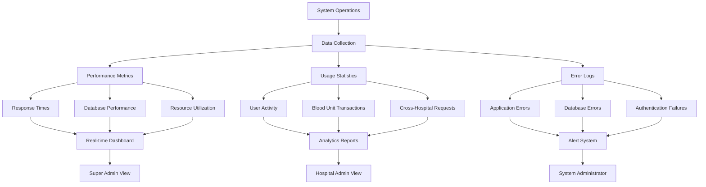

# LifeFlow System Flowcharts

## System Architecture Flow

## Blood Collection Workflow

## Cross-Hospital Blood Request Flow

## Multi-Tenant Database Access Flow

## User Authentication & Authorization Flow

## Blood Inventory Management Flow

## Emergency Request Handling Flow

## System Monitoring & Analytics Flow

## How to View Flowcharts

1. **GitHub/GitLab**: Automatic rendering in markdown
2. **VS Code**: Mermaid Preview extension
3. **Online**: Copy to https://mermaid.live/
4. **Export**: Use Mermaid CLI for images

## Flowchart Legend

- **Rectangles**: Processes/Actions
- **Diamonds**: Decision Points
- **Circles**: Start/End Points
- **Cylinders**: Database Operations
- **Parallelograms**: Input/Output
- **Arrows**: Process Flow Direction